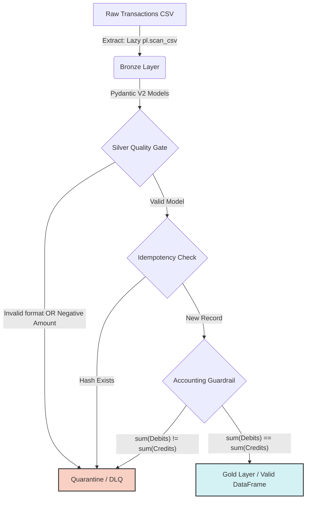

# Financial ETL Pipeline Engine


## Executive Summary

Financial data ingestion is prone to severe technical debt: floating point rounding errors, silent data duplication, and untraceable accounting failures. 

This **Financial ETL Pipeline** solves these systemic problems by implementing a strict **Medallion Architecture (Bronze -> Silver -> Gold)**, backed by rigorous Type Checking and exact Decimal mathematical precision, ensuring CFO-grade reporting accuracy and fault-resilient idempotency.

## Architecture & Data Flow

We implement a Medallion Architecture with aggressive validation checkpoints:



## Technology Stack Rationale

- **Polars over Pandas**: Polars is built in Rust natively using Arrow arrays, providing superior memory efficiency (`pl.scan_csv`) allowing us to process gigabytes of transactions on a single node without OOM (Out Of Memory) issues compared to standard Pandas.
- **Pydantic V2 over Vanilla Classes**: We need to enforce types STRICTLY before data touches internal math logic. Python class type hinting is a suggestion; Pydantic V2 is enforced validation.
- **`decimal.Decimal` over `Float64`**: Floating point arithmetic (e.g., `0.1 + 0.2 = 0.30000000000000004`) destroys financial accounting. Pure string-to-decimal ingestion guarantees zero discrepancy in Ledger Balancing.

## Key Features

1. **Accounting Guardrail Engine**: Rejects unbalanced batches systematically via `sum(debits) = sum(credits)`.
2. **SHA-256 Idempotency**: Automatically creates a deterministic fingerprint for each row. Identical logs are caught and routed to quarantine before they replicate into the Silver layer.
3. **Structured JSON Logging**: Replacing `print()` statements with an Audit Trail via Python's native `logging` configured with a JSON formatter, pushing `transaction_id` records directly for ELK/Datadog integration.

## How to Run & Verify

**1. Setup Environment**
```bash
python -m venv .venv
# Activate your environment
source .venv/bin/activate  # Or .\.venv\Scripts\Activate.ps1 on Windows
pip install -r requirements.txt
```

**2. Run Test Suite (Integrity Verification)**
```bash
pytest tests/ -v
```

**3. Run Orchestrator Flow**
```bash
python main.py
```
